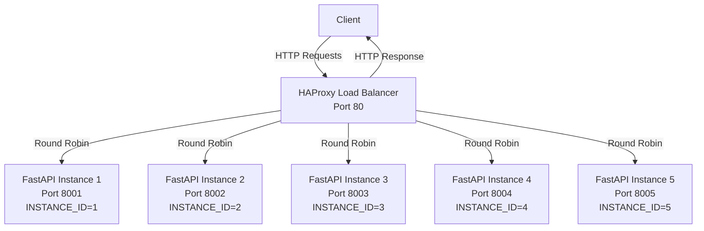

# FastAPI Load Balancer with HAProxy

A simple load-balanced FastAPI application using HAProxy and Docker Compose.

## Architecture



- **5 FastAPI instances** running on ports 8001-8005
- **HAProxy load balancer** distributing traffic on port 80
- **Round-robin load balancing** across all FastAPI instances
- **Improved load distribution** with 2.5x more capacity

## Quick Start

1. **Start the services:**
   ```bash
   docker compose up
   ```

2. **Test the setup:**
   ```bash
   # Test load balancer
   curl http://localhost
   
   # Test individual instances
   curl http://localhost:8001
   curl http://localhost:8002
   curl http://localhost:8003
   curl http://localhost:8004
   curl http://localhost:8005
   ```

## Testing Load Balancing

Run multiple requests to see load distribution:
```bash
for i in {1..10}; do curl http://localhost; echo; done
```

You should see responses rotating between:
- `{"message": "Hello from FastAPI instance 1"}`
- `{"message": "Hello from FastAPI instance 2"}`
- `{"message": "Hello from FastAPI instance 3"}`
- `{"message": "Hello from FastAPI instance 4"}`
- `{"message": "Hello from FastAPI instance 5"}`

## Services

| Service | Port | Description |
|---------|------|-------------|
| HAProxy | 80 | Load balancer frontend |
| FastAPI Instance 1 | 8001 | First FastAPI app |
| FastAPI Instance 2 | 8002 | Second FastAPI app |
| FastAPI Instance 3 | 8003 | Third FastAPI app |
| FastAPI Instance 4 | 8004 | Fourth FastAPI app |
| FastAPI Instance 5 | 8005 | Fifth FastAPI app |

## Files Structure

```
├── app/
│   ├── app.py          # FastAPI application
│   └── Dockerfile      # FastAPI container config
├── haproxy/
│   └── haproxy.cfg     # HAProxy configuration
└── docker-compose.yml  # Service orchestration
```

## Health Check

Check if all containers are running:
```bash
docker compose ps
```

## Load Testing

For performance testing:
```bash
# Install apache bench (macOS)
brew install httpd

# Run load test
ab -n 100 -c 10 http://localhost/
```

## Stopping Services

```bash
docker compose down
```
